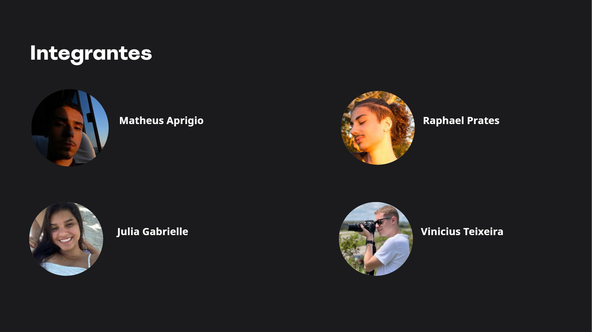

# Sprint 1

Essa Sprint tem duração de:

- `01/02/2024` → `13/03/2024`

## Integrantes do Time

Apresentaremos aqui, cada integrante do time **Metrix**:

## Funções do Time

Dividimos as funções em duas partes: **Responsável** e **Informado**

- **Matheus Aprigio** : `DevOps / Front-End / Documentação / Comunicação` → `Back-End / UX/UI / QA / Scrum Master / BD`
- **Julia Gabrielle** : `Back-End / Front-End / UX/UI / Scrum Master / BD` → `DevOps / Documentação / Comunicação / QA`
- **Raphael Prates** : `DevOps / Back-End / QA / BD` → `Front-End / Documentação / Comunicação / UX/UI / Scrum Master`
- **Vinícius Teixeira** : `DevOps / Front-End / Documentação / Comunicação / Scrum Master` → `Back-End / UX/UI / QA / BD`

## Resumo da Sprint

Nesta Sprint, fizemos todo o mapeamento do processo, buscando entender cada etapa e sanar as dúvidas.

Realizamos o BackLog com as ideias que temos para o projeto, após analisar detalhadamente cada uma, afim de se adaptar com o tempo de desenvolvimento do TCC.

Separamos o time em suas determinadas funções. Também separamos os objetivos para cada parte do time

Realizamos reuniões diárias com a PO para entender cada fluxo e assim conseguir iniciar o desenvolvimento.

Com base nas informações que obtivemos nas reuniões diárias, realizamos os Wireframes (Documentação que pode ser consultada [**aqui**](../tutorial-basics/wireframe)) e validamos com nossa PO, juntamente com todo o time responsável pelo gerenciamento de calibrações dos instrumentos.

## Itens Entregues

Conseguimos entregar os seguintes itens:

- Mapeamento do Processo já realizado atualmente [**aqui**](https://miro.com/app/board/uXjVNHQ-h0I=/)
- BackLog das funções [**aqui**](https://trello.com/b/SkSD7afT/tcc)
- Wireframe [**aqui**](https://www.figma.com/file/rDQBDEdMd3A4kOsKBaypCR/Untitled?type=design&node-id=18-32&mode=design&t=9gkDMdXpLoPekXKr-0)
- Criação da Infraestrutura do Banco de Dados
- Criação do Banco de Dados
- Protótipo do primeiro fluxo de tela a ser desenvolvido **(Saída para uso)**
- Api com endpoints necessários para funcionar o fluxo inicial

## Itens Iniciados

Iniciamos os seguintes itens, com finalização na próxima Sprint:

- Desenvolvimento front-end seguindo o Protótipo
- Integração do front-end com o backend

